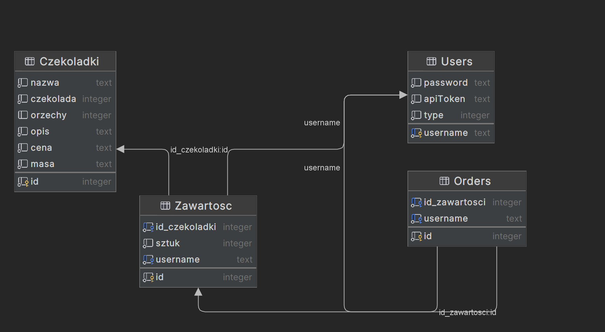

# Candy Shop
## Project Description 

Project simulating a simple chocolate shop. 
It allows user login, account creation by the administrator, validation, and simulated chocolate purchase capability. Users can view, add to cart, remove from cart, and modify orders.
The administrator can change orders for subordinate users. 
Everyone can preview available chocolates and filter them.

## Tech Stack:

<div>
    
	
	
</div>

## How to run Candy Shop

1. Clone GitHub repository
   [GitHub Docs - Cloning a repository](https://docs.github.com/en/repositories/creating-and-managing-repositories/cloning-a-repository)
2. Make sure that the required tools are installed on your computer.
<ul>
        <li><a href="https://dotnet.microsoft.com/en-us/download/dotnet/8.0">.NET 8.0</a></li>
        <li>Required packages: 

```diff
            Microsoft.AspNetCore.Identity.EntityFrameworkCore, 
            Microsoft.EntityFrameworkCore.Design, 
            Microsoft.EntityFrameworkCore.SQLite, 
            Microsoft.EntityFrameworkCore.SqlServer, 
            Microsoft.EntityFrameworkCore.Tools, 
            Microsoft.VisualStudio.Web.CodeGeneration.Design.
```

</li>
</ul>

3. After opening the project and downloading the required tools and packages, run the following command in the terminal:
   <code>dotnet ef database update</code>

## Database


## Application 
[Screenshots from the application](https://github.com/soberyoda/Candy_Shop/tree/main/assets)